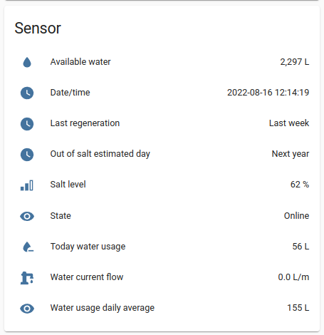

# iQua app supported water softeners integration for Home Assistant

`iqua_softener` is a _custom component_ for [Home Assistant](https://www.home-assistant.io/). The integration allows you to pull data for you iQua app supported water softener from Ecowater company server.

It will create nine sensors (refreshed every 5 seconds):
- State - whether the softener is connected to Ecowater server
- Date/time - date and time set on water softener
- Last regeneration - the day of last regeneration
- Out of salt estimated day - the day on which the end of salt is predicted
- Salt level - salt level load in percentage
- Today water usage - water used today
- Water current flow - current flow of water
- Water usage daily average - computed average by softener of daily usage
- Available water - water available to use before next regeneration

The units displayed are set in the application settings.

## Installation
Copy the `custom_components/iqua_softener` folder into the config folder.

## Configuration
To add an iQua water softener to Home assistant, go to Settings and click "+ ADD INTEGRATION" button. From list select "iQua Softener" and click it, in displayed window you must enter:
- Username - username for iQua application
- Password - password for iQua application
- Serial number - device serial number, you can find it in iQua app device information tab and field called "DSN#" (this field is case sensitive!)

## License
[MIT](https://choosealicense.com/licenses/mit/)
